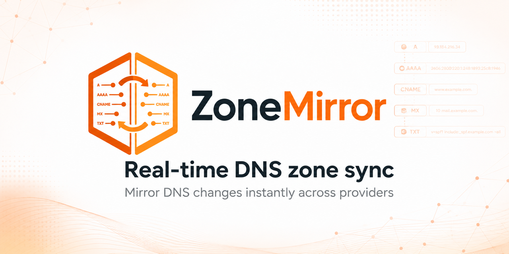
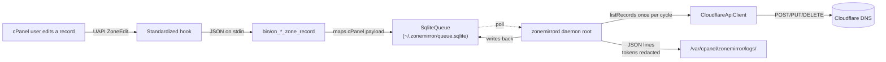

<p align="center">
  <a href="https://zonemirror.com">
    
  </a>
</p>

<p align="center">
  <strong>cPanel/WHM plugin that mirrors Zone Editor changes into Cloudflare in real time.</strong><br>
  Multi-tenant · per-user encrypted tokens · zero cron jobs · systemd-supervised.
</p>

<p align="center">
  <a href="https://github.com/zonemirror/zonemirror/actions/workflows/ci.yml"></a>
  <a href="LICENSE"></a>
  <a href="composer.json"></a>
  <a href="https://docs.cpanel.net/"></a>
  <a href="https://github.com/zonemirror/zonemirror/releases"></a>
  <a href="https://github.com/sponsors/CristianDeluxe"></a>
  <a href="#project-status"></a>
</p>

# ZoneMirror

## Table of contents

- [Quick start](#quick-start)
- [Why use this](#why-use-this)
- [How it works](#how-it-works)
- [Requirements](#requirements)
- [Install](#install)
- [Update](#update)
- [Configuration reference](#configuration-reference)
- [Diagnostics](#diagnostics)
- [Uninstall](#uninstall)
- [Security](#security)
- [FAQ](#faq)
- [Development](#development)
- [Documentation](#documentation)
- [Project status](#project-status)
- [Versioning](#versioning)
- [Support](#support)
- [Roadmap](#roadmap)
- [Contributing](#contributing)
- [Acknowledgements](#acknowledgements)
- [License](#license)

---

## Quick start

```bash
curl -fsSL https://raw.githubusercontent.com/zonemirror/zonemirror/main/packaging/bootstrap.sh \
  | sudo bash
```

That one line on a cPanel/WHM server (PHP 8.1+, cPanel 108+) downloads the latest signed release,
verifies its SHA-256, installs the plugin under `/usr/local/cpanel/3rdparty/`, registers the
standardized hooks, starts the systemd daemon, and drops a `zonemirror` CLI in `/usr/local/bin/`.

```bash
sudo zonemirror version          # show installed + latest
sudo zonemirror check            # check for updates (exit 10 if newer available)
sudo zonemirror update           # upgrade to latest GitHub release
sudo zonemirror auto-update on   # enable daily auto-update timer
sudo zonemirror status           # daemon / hooks / queues snapshot
sudo zonemirror logs -n 200      # tail the plugin log
```

---

## Why use this

Most cPanel-to-Cloudflare workflows are a hand-rolled Python script run by cron that exports
`whmapi1 dumpzone`, transforms it, and POSTs to Cloudflare. That works for one zone, one admin, one
server. It breaks the moment you:

- have **more than one cPanel user** with their own Cloudflare account,
- want **real-time** instead of "next cron tick" propagation,
- need to **roll back safely** when Cloudflare returns a 429,
- want **audit logs** without secrets leaking into `/var/log`,
- need a **kill switch** when something's clearly wrong.

This plugin solves all five. It also ships proper packaging, tests, documentation, and a self-update
path — so it's something you can put on a fleet of cPanel servers and not think about again.

|                                     | Hand-rolled cron script | This plugin                      |
| ----------------------------------- | ----------------------- | -------------------------------- |
| Real-time sync                      | next tick               | on every Zone Editor change      |
| Multi-user (per-tenant tokens)      | no                      | yes                              |
| Encrypted tokens at rest            | no                      | XChaCha20-Poly1305               |
| Idempotent retries with dead-letter | no                      | SQLite queue, attempts ≥ 8 → DLQ |
| Honors Cloudflare `Retry-After`     | no                      | yes                              |
| Dry-run kill switch                 | no                      | WHM toggle                       |
| Token redaction in logs             | no                      | yes                              |
| CSRF + strict CSP on UI             | no                      | yes                              |
| One-line install, auto-update       | no                      | `zonemirror update`              |
| 33 unit tests + PHPStan level 8     | no                      | yes                              |

---

## How it works



- Each cPanel user has their own SQLite event queue under their `$HOME`.
- The root daemon iterates enrolled users, fetches a **single** zone snapshot per cycle, then drains
  up to 25 events per user before sleeping.
- The WHM admin sets global guardrails (allowlist, default proxied behaviour, TTL, `rate_limit_rps`
  budget, dry-run mode).
- A successful hook never crashes cPanel — anything thrown is caught, logged, and discarded.

See [`docs/ARCHITECTURE.md`](docs/ARCHITECTURE.md) for the full breakdown.

---

## Requirements

- cPanel & WHM **108+** (Jupiter theme)
- PHP **8.1+** with `curl`, `pdo_sqlite`, `openssl` (and optionally `sodium`)
- Linux with `systemd`
- A Cloudflare **API Token** (not Global API Key) scoped to the zones each user wants to mirror,
  with `Zone:DNS:Edit` + `Zone:Zone:Read`

---

## Install

### Option 1 — One-liner (recommended)

```bash
curl -fsSL https://raw.githubusercontent.com/zonemirror/zonemirror/main/packaging/bootstrap.sh \
  | sudo bash
```

This pulls the latest GitHub release tarball, verifies its SHA-256, stages it under
`/opt/zonemirror/releases/<version>/`, symlinks `/opt/zonemirror/current` to it, and runs
`packaging/install.sh`. Re-running upgrades in place and keeps the last three releases for rollback.

Pin a specific version:

```bash
curl -fsSL https://raw.githubusercontent.com/zonemirror/zonemirror/main/packaging/bootstrap.sh \
  | sudo VERSION=v0.1.0 bash
```

### Option 2 — Clone + install

```bash
git clone https://github.com/zonemirror/zonemirror.git
cd zonemirror
composer install --no-dev --prefer-dist --optimize-autoloader
sudo bash packaging/install.sh
```

### After installing

1. **WHM → Plugins → ZoneMirror** — set global defaults / allowlist / dry-run mode.
2. **cPanel → Domains → ZoneMirror** (per allowlisted user) — paste the Cloudflare API token, pick
   the zone, "Test connection", **Enable**.
3. Tail the log on the server:
   ```bash
   sudo tail -f /var/cpanel/zonemirror/logs/zonemirror.log
   ```

A test edit in cPanel's Zone Editor should land in Cloudflare in **under 2 seconds**.

---

## Update

Manual:

```bash
sudo zonemirror update              # upgrade to latest GitHub release
sudo zonemirror update --dry-run    # show what would happen
```

Automatic (daily, with randomized 0-3 h delay so a fleet doesn't all hit GitHub at the same minute):

```bash
sudo zonemirror auto-update on      # enable systemd timer
sudo zonemirror auto-update off     # disable
```

The auto-update systemd unit is **off by default**. Operators opt in explicitly; production fleets
typically prefer a separate change-management workflow.

Every update verifies the release tarball's SHA-256 against the matching `.sha256` file shipped
alongside it on the GitHub release page.

---

## Configuration reference

### WHM admin (`/var/cpanel/zonemirror/system.json`)

| Field              | Type                     | Default | Notes                                                     |
| ------------------ | ------------------------ | ------- | --------------------------------------------------------- |
| `defaults.proxied` | bool                     | `false` | Default proxy flag for new A/AAAA/CNAME on enrolled users |
| `defaults.ttl`     | int (s)                  | `300`   | Minimum 60; cPanel sometimes asks for shorter TTLs        |
| `allowed_users`    | `"all"` \| list of users | `"all"` | Per-user gate enforced at hook + daemon                   |
| `rate_limit_rps`   | int 1-50                 | `5`     | Inter-call sleep enforced in the worker                   |
| `dry_run`          | bool                     | `false` | Kill switch — logs intended changes, makes no API calls   |

### Per cPanel user (`~/.zonemirror/config.json`)

| Field              | Type            | Notes                                                     |
| ------------------ | --------------- | --------------------------------------------------------- |
| `enabled`          | bool            | Master on/off for this user                               |
| `zone_id`          | string          | Resolved automatically when the user enters the zone name |
| `zone_name`        | string          | The bare domain (e.g. `example.com`)                      |
| `defaults.proxied` | bool            | Overrides WHM default for this user                       |
| `token_encrypted`  | string (base64) | AEAD ciphertext; never decrypted in the hook path         |

---

## Diagnostics

| Symptom                | Command                                                                                  |
| ---------------------- | ---------------------------------------------------------------------------------------- |
| Hook didn't fire       | `/usr/local/cpanel/bin/manage_hooks list \| grep zonemirror`                             |
| Daemon health          | `sudo zonemirror status`                                                                 |
| Recent daemon errors   | `sudo journalctl -u zonemirrord -n 100 --no-pager`                                       |
| Queue depth (per user) | `sqlite3 /home/<user>/.zonemirror/queue.sqlite 'SELECT COUNT(*) FROM events;'`           |
| Dead-letters           | `sqlite3 .../queue.sqlite 'SELECT id,last_error FROM events WHERE dead_at IS NOT NULL;'` |
| Master key permissions | `ls -la /var/cpanel/zonemirror/master.key` (expect `root:root 0600`)                     |
| Tail plugin log        | `sudo zonemirror logs -n 200`                                                            |

For deeper symptom-to-fix mapping see [`docs/PERFORMANCE.md`](docs/PERFORMANCE.md). For the attacker
model and hardening summary, see [`SECURITY.md`](SECURITY.md).

---

## Uninstall

Keep config + queues (resumable on reinstall):

```bash
sudo bash /usr/local/cpanel/3rdparty/zonemirror/packaging/uninstall.sh
```

Full purge (including all per-user state):

```bash
sudo bash /usr/local/cpanel/3rdparty/zonemirror/packaging/uninstall.sh --purge
```

---

## Security

- API tokens are encrypted at rest with libsodium XChaCha20-Poly1305 (with an AES-256-GCM/OpenSSL
  fallback). Master key is root-only.
- Hooks running as the cPanel user **never** read the master key — they consult only the unencrypted
  metadata half of the config.
- `TokenRedactor` scrubs bearer headers, JSON token fields, and any 40+ character identifier from
  every log line before write.
- CSRF tokens are `hash_equals`-validated and rotated on successful POST.
- The systemd unit is hardened (`NoNewPrivileges`, `ProtectHome=read-only`,
  `MemoryDenyWriteExecute`).
- `_acme-challenge` and `_dmarc` records are **never** proxied, regardless of defaults — proxying
  would break Let's Encrypt validation and DMARC reporting respectively.

Vulnerabilities? Read [`SECURITY.md`](SECURITY.md) — please don't open a public issue.

---

## FAQ

**Will my cPanel still work if the daemon dies?** Yes. Hooks are best-effort and never raise. cPanel
never knows we're there. If the daemon crashes, events accumulate in each user's SQLite queue and
drain when systemd restarts it.

**What happens during a Cloudflare API outage?** The queue retries with exponential backoff + jitter
(max 8 attempts before dead-letter). The Cloudflare `Retry-After` header is honored. WHM admins can
flip `dry_run` as a kill switch.

**Can I sync from Cloudflare back to cPanel?** Not in v1. The plugin is one-way (cPanel →
Cloudflare). A manual "Import from Cloudflare" use case is scaffolded for the initial seed; full
bidirectional sync requires CF webhooks and a public endpoint, which is deliberately out of scope
for v1.

**What record types are supported?** A, AAAA, CNAME, MX, TXT, SRV, CAA. Apex `NS` is intentionally
skipped (CF manages those). Unknown types are silently ignored.

**Where do I see what changed?** `/var/cpanel/zonemirror/logs/zonemirror.log` is one JSON object per
line. Filter with `jq`:

```bash
jq -c 'select(.level == "info" and (.msg | startswith("created") or startswith("updated") or startswith("deleted")))' \
  /var/cpanel/zonemirror/logs/zonemirror.log
```

---

## Development

```bash
git clone https://github.com/zonemirror/zonemirror.git
cd zonemirror
composer install
composer check         # lint + phpstan + phpunit
make format            # PHP + shell + prettier
```

Hooks for the host environment:

| Command                             | Purpose                            |
| ----------------------------------- | ---------------------------------- |
| `composer test`                     | PHPUnit (33 tests)                 |
| `composer analyse`                  | PHPStan level 8 + strict rules     |
| `composer lint:php`                 | PHP-CS-Fixer dry-run               |
| `composer format:php`               | PHP-CS-Fixer apply                 |
| `bash scripts/format-sh.sh --write` | shfmt over `bin/` and `packaging/` |

Reproducing a hook locally without touching cPanel:

```bash
echo '{"data":{"args":{"domain":"example.com"},"result":{"data":{"type":"A","name":"www.example.com.","address":"203.0.113.10","ttl":300}}}}' \
  | ZONEMIRROR_USER_HOME=/tmp/zonemirror-dev \
    php bin/on_add_zone_record
```

---

## Documentation

| Document                                       | What's inside                                                               |
| ---------------------------------------------- | --------------------------------------------------------------------------- |
| [`docs/ARCHITECTURE.md`](docs/ARCHITECTURE.md) | Lifecycle of a DNS edit, layered dependencies, filesystem map, design notes |
| [`docs/PERFORMANCE.md`](docs/PERFORMANCE.md)   | Throughput numbers, bottlenecks, symptom-to-fix mapping                     |
| [`docs/adr/`](docs/adr/)                       | Architecture Decision Records                                               |
| [`SECURITY.md`](SECURITY.md)                   | Threat model summary, hardening notes, private vulnerability reporting      |
| [`CONTRIBUTING.md`](CONTRIBUTING.md)           | Ground rules, quality gate, "add a new record type" walkthrough             |
| [`CHANGELOG.md`](CHANGELOG.md)                 | Per-release notable changes (Keep a Changelog format)                       |
| [`CODE_OF_CONDUCT.md`](CODE_OF_CONDUCT.md)     | Community standards (Contributor Covenant 2.1)                              |

---

## Project status

**Beta.** v0.1.x — the architecture is stable and the test suite is green on PHP 8.1 / 8.2 / 8.3,
but the plugin has not yet been battle-tested on a large fleet. Treat it as production-capable with
monitoring; run `zonemirror status` on a schedule and tail the JSON log.

Breaking changes between `0.x` releases are possible but will be called out in
[`CHANGELOG.md`](CHANGELOG.md) under a dedicated **Breaking** heading.

---

## Versioning

This project follows [Semantic Versioning 2.0.0](https://semver.org/spec/v2.0.0.html):

- **MAJOR** — incompatible changes to the on-disk config schema, the hook protocol, or the CLI
  surface.
- **MINOR** — backwards-compatible features (new record types, new CLI subcommands, new defaults).
- **PATCH** — backwards-compatible fixes, performance work, and documentation.

`VERSION` at the repo root is the single source of truth. Release tarballs are SHA-256-pinned;
`zonemirror update` verifies the signature against the matching `.sha256` sidecar.

The latest minor release line is the only one that receives security patches — see
[`SECURITY.md`](SECURITY.md).

---

## Support

- **Bugs / questions / feature requests** —
  [open a GitHub issue](https://github.com/zonemirror/zonemirror/issues/new/choose). Templates exist
  for both bug reports and feature requests.
- **Security vulnerabilities** — do **not** open a public issue. Email `security@zonemirror.com`;
  see [`SECURITY.md`](SECURITY.md) for the disclosure window.
- **Code of conduct concerns** — `conduct@zonemirror.com`.

This is a community-maintained project; there is no paid support tier. PRs that fix real-world
issues are the fastest path to a resolved bug.

---

## Roadmap

- [ ] Bulk "Import from Cloudflare" UI with diff preview
- [ ] WHM-side dead-letter inspector (currently only via `sqlite3` CLI)
- [ ] Optional Prometheus exporter (`/metrics` on a unix socket)
- [ ] GPG-signed release artifacts
- [ ] Submit to cPanel's marketplace

---

## Contributing

PRs welcome — see [`CONTRIBUTING.md`](CONTRIBUTING.md). The quality gate is `composer check` plus a
green CI matrix (PHP 8.1 / 8.2 / 8.3).

Code of conduct: [`CODE_OF_CONDUCT.md`](CODE_OF_CONDUCT.md).

---

## Acknowledgements

- [cPanel & WHM](https://docs.cpanel.net/) — for the standardized hook system and LiveAPI that make
  a plugin like this possible without core patches.
- [Cloudflare API](https://developers.cloudflare.com/api/) — `Retry-After` and rate-limit headers
  done the way every API should do them.
- [PHPStan](https://phpstan.org/), [PHP-CS-Fixer](https://cs.symfony.com/), and
  [PHPUnit](https://phpunit.de/) — the static-analysis and test stack that keeps the bar high.

---

## License

[MIT](LICENSE) © 2026 ZoneMirror

---

## Trademarks

ZoneMirror is an independent project and is not affiliated with, endorsed by, or sponsored by
Cloudflare, Inc., WebPros International, LLC, cPanel, LLC, or their affiliates. "Cloudflare",
"cPanel", "WHM", and related marks are trademarks of their respective owners. Any references to
those services in this project are for compatibility and interoperability purposes only.
