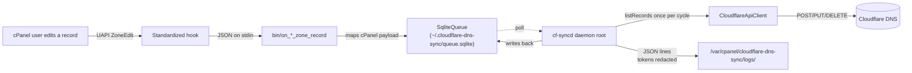

# Cloudflare DNS Sync for cPanel

> Real-time mirror of cPanel's Zone Editor into Cloudflare. Multi-tenant. One token per cPanel user.
> Zero cron jobs.

[](https://github.com/BusiRocket/cpanel-cloudflare-dns-sync/actions/workflows/ci.yml)
[](LICENSE)
[](composer.json)
[](https://docs.cpanel.net/)
[](https://github.com/BusiRocket/cpanel-cloudflare-dns-sync/releases)

---

## TL;DR

```bash
curl -fsSL https://raw.githubusercontent.com/BusiRocket/cpanel-cloudflare-dns-sync/main/packaging/bootstrap.sh \
  | sudo bash
```

That one line on a cPanel/WHM server (PHP 8.1+, cPanel 108+) downloads the latest signed release,
verifies its SHA-256, installs the plugin under `/usr/local/cpanel/3rdparty/`, registers the
standardized hooks, starts the systemd daemon, and drops a `cfsync` CLI in `/usr/local/bin/`.

```bash
sudo cfsync version          # show installed + latest
sudo cfsync check            # check for updates (exit 10 if newer available)
sudo cfsync update           # upgrade to latest GitHub release
sudo cfsync auto-update on   # enable daily auto-update timer
sudo cfsync status           # daemon / hooks / queues snapshot
sudo cfsync logs -n 200      # tail the plugin log
```

---

## Why use this

Most cPanel-to-Cloudflare workflows are a hand-rolled Python script run by cron that exports
`whmapi1 dumpzone`, transforms it, and POSTs to Cloudflare. That works for one zone, one admin, one
server. It breaks the moment you:

- have **more than one cPanel user** with their own Cloudflare account,
- want **real-time** instead of "next cron tick" propagation,
- need to **roll back safely** when Cloudflare returns a 429,
- want **audit logs** without secrets leaking into `/var/log`,
- need a **kill switch** when something's clearly wrong.

This plugin solves all five. It also ships proper packaging, tests, documentation, and a self-update
path — so it's something you can put on a fleet of cPanel servers and not think about again.

|                                     | Hand-rolled cron script | This plugin                      |
| ----------------------------------- | ----------------------- | -------------------------------- |
| Real-time sync                      | next tick               | on every Zone Editor change      |
| Multi-user (per-tenant tokens)      | no                      | yes                              |
| Encrypted tokens at rest            | no                      | XChaCha20-Poly1305               |
| Idempotent retries with dead-letter | no                      | SQLite queue, attempts ≥ 8 → DLQ |
| Honors Cloudflare `Retry-After`     | no                      | yes                              |
| Dry-run kill switch                 | no                      | WHM toggle                       |
| Token redaction in logs             | no                      | yes                              |
| CSRF + strict CSP on UI             | no                      | yes                              |
| One-line install, auto-update       | no                      | `cfsync update`                  |
| 30+ unit tests + PHPStan level 8    | no                      | yes                              |

---

## How it works



- Each cPanel user has their own SQLite event queue under their `$HOME`.
- The root daemon iterates enrolled users, fetches a **single** zone snapshot per cycle, then drains
  up to 25 events per user before sleeping.
- The WHM admin sets global guardrails (allowlist, default proxied behaviour, TTL, `rate_limit_rps`
  budget, dry-run mode).
- A successful hook never crashes cPanel — anything thrown is caught, logged, and discarded.

See [`docs/ARCHITECTURE.md`](docs/ARCHITECTURE.md) for the full breakdown.

---

## Requirements

- cPanel & WHM **108+** (Jupiter theme)
- PHP **8.1+** with `curl`, `pdo_sqlite`, `openssl` (and optionally `sodium`)
- Linux with `systemd`
- A Cloudflare **API Token** (not Global API Key) scoped to the zones each user wants to mirror,
  with `Zone:DNS:Edit` + `Zone:Zone:Read`

---

## Install

### Option 1 — One-liner (recommended)

```bash
curl -fsSL https://raw.githubusercontent.com/BusiRocket/cpanel-cloudflare-dns-sync/main/packaging/bootstrap.sh \
  | sudo bash
```

This pulls the latest GitHub release tarball, verifies its SHA-256, stages it under
`/opt/cloudflare-dns-sync/releases/<version>/`, symlinks `/opt/cloudflare-dns-sync/current` to it,
and runs `packaging/install.sh`. Re-running upgrades in place and keeps the last three releases for
rollback.

Pin a specific version:

```bash
curl -fsSL https://raw.githubusercontent.com/BusiRocket/cpanel-cloudflare-dns-sync/main/packaging/bootstrap.sh \
  | sudo VERSION=v0.1.0 bash
```

### Option 2 — Clone + install

```bash
git clone https://github.com/BusiRocket/cpanel-cloudflare-dns-sync.git
cd cpanel-cloudflare-dns-sync
composer install --no-dev --prefer-dist --optimize-autoloader
sudo bash packaging/install.sh
```

### After installing

1. **WHM → Plugins → Cloudflare DNS Sync** — set global defaults / allowlist / dry-run mode.
2. **cPanel → Domains → Cloudflare DNS Sync** (per allowlisted user) — paste the Cloudflare API
   token, pick the zone, "Test connection", **Enable**.
3. Tail the log on the server:
   ```bash
   sudo tail -f /var/cpanel/cloudflare-dns-sync/logs/cf-sync.log
   ```

A test edit in cPanel's Zone Editor should land in Cloudflare in **under 2 seconds**.

---

## Update

Manual:

```bash
sudo cfsync update              # upgrade to latest GitHub release
sudo cfsync update --dry-run    # show what would happen
```

Automatic (daily, with randomized 0-3 h delay so a fleet doesn't all hit GitHub at the same minute):

```bash
sudo cfsync auto-update on      # enable systemd timer
sudo cfsync auto-update off     # disable
```

The auto-update systemd unit is **off by default**. Operators opt in explicitly; production fleets
typically prefer a separate change-management workflow.

Every update verifies the release tarball's SHA-256 against the matching `.sha256` file shipped
alongside it on the GitHub release page.

---

## Configuration reference

### WHM admin (`/var/cpanel/cloudflare-dns-sync/system.json`)

| Field              | Type                     | Default | Notes                                                     |
| ------------------ | ------------------------ | ------- | --------------------------------------------------------- |
| `defaults.proxied` | bool                     | `false` | Default proxy flag for new A/AAAA/CNAME on enrolled users |
| `defaults.ttl`     | int (s)                  | `300`   | Minimum 60; cPanel sometimes asks for shorter TTLs        |
| `allowed_users`    | `"all"` \| list of users | `"all"` | Per-user gate enforced at hook + daemon                   |
| `rate_limit_rps`   | int 1-50                 | `5`     | Inter-call sleep enforced in the worker                   |
| `dry_run`          | bool                     | `false` | Kill switch — logs intended changes, makes no API calls   |

### Per cPanel user (`~/.cloudflare-dns-sync/config.json`)

| Field              | Type            | Notes                                                     |
| ------------------ | --------------- | --------------------------------------------------------- |
| `enabled`          | bool            | Master on/off for this user                               |
| `zone_id`          | string          | Resolved automatically when the user enters the zone name |
| `zone_name`        | string          | The bare domain (e.g. `example.com`)                      |
| `defaults.proxied` | bool            | Overrides WHM default for this user                       |
| `token_encrypted`  | string (base64) | AEAD ciphertext; never decrypted in the hook path         |

---

## Diagnostics

| Symptom                | Command                                                                                  |
| ---------------------- | ---------------------------------------------------------------------------------------- |
| Hook didn't fire       | `/usr/local/cpanel/bin/manage_hooks list \| grep cloudflare-dns-sync`                    |
| Daemon health          | `sudo cfsync status`                                                                     |
| Recent daemon errors   | `sudo journalctl -u cloudflare-dns-syncd -n 100 --no-pager`                              |
| Queue depth (per user) | `sqlite3 /home/<user>/.cloudflare-dns-sync/queue.sqlite 'SELECT COUNT(*) FROM events;'`  |
| Dead-letters           | `sqlite3 .../queue.sqlite 'SELECT id,last_error FROM events WHERE dead_at IS NOT NULL;'` |
| Master key permissions | `ls -la /var/cpanel/cloudflare-dns-sync/master.key` (expect `root:root 0600`)            |
| Tail plugin log        | `sudo cfsync logs -n 200`                                                                |

For deeper symptom-to-fix mapping see [`docs/PERFORMANCE.md`](docs/PERFORMANCE.md) and
[`docs/THREAT_MODEL.md`](docs/THREAT_MODEL.md).

---

## Uninstall

Keep config + queues (resumable on reinstall):

```bash
sudo bash /usr/local/cpanel/3rdparty/cloudflare-dns-sync/packaging/uninstall.sh
```

Full purge (including all per-user state):

```bash
sudo bash /usr/local/cpanel/3rdparty/cloudflare-dns-sync/packaging/uninstall.sh --purge
```

---

## Security

- API tokens are encrypted at rest with libsodium XChaCha20-Poly1305 (with an AES-256-GCM/OpenSSL
  fallback). Master key is root-only.
- Hooks running as the cPanel user **never** read the master key — they consult only the unencrypted
  metadata half of the config.
- `TokenRedactor` scrubs bearer headers, JSON token fields, and any 40+ character identifier from
  every log line before write.
- CSRF tokens are `hash_equals`-validated and rotated on successful POST.
- The systemd unit is hardened (`NoNewPrivileges`, `ProtectHome=read-only`,
  `MemoryDenyWriteExecute`).
- `_acme-challenge` and `_dmarc` records are **never** proxied, regardless of defaults — proxying
  would break Let's Encrypt validation and DMARC reporting respectively.

Vulnerabilities? Read [`SECURITY.md`](SECURITY.md) — please don't open a public issue.

---

## FAQ

**Will my cPanel still work if the daemon dies?** Yes. Hooks are best-effort and never raise. cPanel
never knows we're there. If the daemon crashes, events accumulate in each user's SQLite queue and
drain when systemd restarts it.

**What happens during a Cloudflare API outage?** The queue retries with exponential backoff + jitter
(max 8 attempts before dead-letter). The Cloudflare `Retry-After` header is honored. WHM admins can
flip `dry_run` as a kill switch.

**Can I sync from Cloudflare back to cPanel?** Not in v1. The plugin is one-way (cPanel →
Cloudflare). A manual "Import from Cloudflare" use case is scaffolded for the initial seed; full
bidirectional sync requires CF webhooks and a public endpoint, which is deliberately out of scope
for v1.

**What record types are supported?** A, AAAA, CNAME, MX, TXT, SRV, CAA. Apex `NS` is intentionally
skipped (CF manages those). Unknown types are silently ignored.

**Where do I see what changed?** `/var/cpanel/cloudflare-dns-sync/logs/cf-sync.log` is one JSON
object per line. Filter with `jq`:

```bash
jq -c 'select(.level == "info" and (.msg | startswith("created") or startswith("updated") or startswith("deleted")))' \
  /var/cpanel/cloudflare-dns-sync/logs/cf-sync.log
```

---

## Development

```bash
git clone https://github.com/BusiRocket/cpanel-cloudflare-dns-sync.git
cd cpanel-cloudflare-dns-sync
composer install
composer check         # lint + phpstan + phpunit
make format            # PHP + shell + prettier
```

Hooks for the host environment:

| Command                             | Purpose                            |
| ----------------------------------- | ---------------------------------- |
| `composer test`                     | PHPUnit (33 tests)                 |
| `composer analyse`                  | PHPStan level 8 + strict rules     |
| `composer lint:php`                 | PHP-CS-Fixer dry-run               |
| `composer format:php`               | PHP-CS-Fixer apply                 |
| `bash scripts/format-sh.sh --write` | shfmt over `bin/` and `packaging/` |

Reproducing a hook locally without touching cPanel:

```bash
echo '{"data":{"args":{"domain":"example.com"},"result":{"data":{"type":"A","name":"www.example.com.","address":"203.0.113.10","ttl":300}}}}' \
  | CFSYNC_USER_HOME=/tmp/cfsync-dev \
    php bin/on_add_zone_record
```

---

## Roadmap

- [ ] Bulk "Import from Cloudflare" UI with diff preview
- [ ] WHM-side dead-letter inspector (currently only via `sqlite3` CLI)
- [ ] Optional Prometheus exporter (`/metrics` on a unix socket)
- [ ] GPG-signed release artifacts
- [ ] Submit to cPanel's marketplace

---

## Contributing

PRs welcome — see [`CONTRIBUTING.md`](CONTRIBUTING.md). The quality gate is `composer check` plus a
green CI matrix (PHP 8.1 / 8.2 / 8.3).

Code of conduct: [`CODE_OF_CONDUCT.md`](CODE_OF_CONDUCT.md).

## License

[MIT](LICENSE) © 2026 BusiRocket
